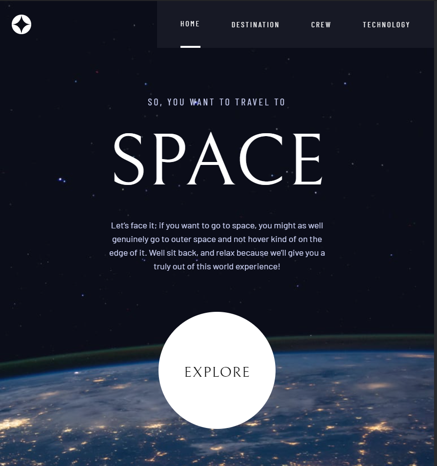

# Frontend Mentor - Space tourism website solution

This is a solution to the [Space tourism website challenge on Frontend Mentor](https://www.frontendmentor.io/challenges/space-tourism-multipage-website-gRWj1URZ3). Frontend Mentor challenges help you improve your coding skills by building realistic projects. 

## Table of contents

- [Overview](#overview)
  - [The challenge](#the-challenge)
  - [Screenshot](#screenshot)
  - [Links](#links)
- [My process](#my-process)
  - [Built with](#built-with)
  - [What I learned](#what-i-learned)
  - [Continued development](#continued-development)
- [Author](#author)

## Overview

### The challenge

Users should be able to:

- View the optimal layout for each of the website's pages depending on their device's screen size
- See hover states for all interactive elements on the page
- View each page and be able to toggle between the tabs to see new information

### Screenshot

### Links

- Solution URL: [Click](https://github.com/ShafranIvan/spaceExploration/tree/master)
- Live Site URL: [Clack](https://shafranivan.github.io/spaceExploration/#/)
- Figma Design URL: [Cluck](https://www.figma.com/file/y5AWdF3qo8sVA4PB4OqJ5k/space-tourism-website?node-id=0%3A1)

## My process

### Built with

- Semantic HTML5 markup
- CSS custom properties
- [Tailwind](https://tailwindcss.com/) - CSS framework
- Flexbox
- Mobile-first workflow
- [React](https://reactjs.org/) - JS library
- React router
- Github Pages

### What I learned
I improved my css, React, React-Router and tailwind knowledge. Also learned how to use lazy loading.
I wouldn't highlight some code or anything because this project mainly consists of css and html.

### Continued development

I want to continue developing with tailwind and react.
Also i will look more deeply into Framer motion.

## Author

- Frontend Mentor - [@ShafranIvan](https://www.frontendmentor.io/profile/ShafranIvan)
- Twitter - [@Shafran_Ivan](https://twitter.com/Shafran_Ivan)
- Telegram - [@in_van](https://t.me/in_van)
